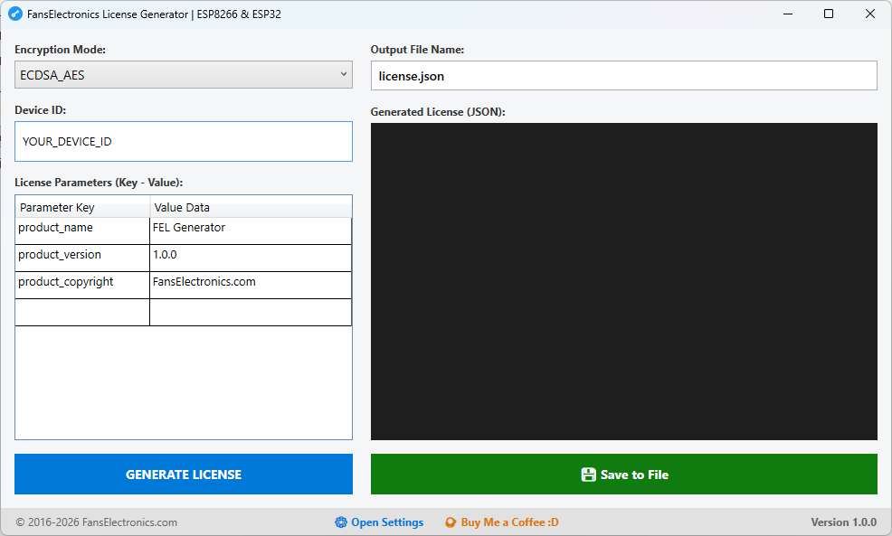

# 🛠️ FansElectronics License Generator
[🇺🇸 English Version](README.md)

---

# 🚀 FEL Generator (Windows Desktop App)

Generator utama adalah aplikasi desktop **FEL Generator.exe** yang berjalan langsung di Windows.



## ✨ Keunggulan

- GUI sederhana dan mudah digunakan
- Portable (tanpa instalasi)
- Tidak membutuhkan PHP atau framework
- 100% Offline
- Generate, Copy, dan Save `license.json` hanya dengan satu klik

## Cara Menggunakan

1. Download **FEL Generator.exe** dari halaman **Releases / Folder tools**.
2. Jalankan aplikasi.
3. Pada saat pertama dijalankan, aplikasi otomatis membuat:

```
config.json
private_key.pem
public_key.pem
```

4. Ganti isi `private_key.pem` dengan **ECDSA Private Key** milik Anda (jika belum jalankan **generate_keys.sh**).
5. Masukkan **Device ID**.
6. Pilih metode enkripsi.
7. Klik **Generate License**.
8. Simpan hasil sebagai `license.json`.

## Pengaturan Applikasi
sesuiakan pengaturan default, terutama **HMAC_SECRET_KEY** dan **AES_SECRET_KEY** samakan dengan pada program Arduino.
```
{
  "HMAC_SECRET_KEY": "MY_HMAC_SECRET",
  "AES_SECRET_KEY": "MY_AES_SECRET",
  "DefaultEncryptionMode": "ECDSA_AES",
  "DefaultFileName": "license.json",
  "DefaultParameters": {
    "product_name": "FEL Generator",
    "product_version": "1.0.0",
    "product_copyright": "FansElectronics.com"
  }
}
```

---

# 💻 Alternatif: PHP CLI

Versi PHP tetap disediakan untuk integrasi ke dashboard web atau backend.

## Requirement

Download PHP:

https://www.php.net/downloads.php

Cek instalasi:

```bash
php -v
```

---

## 🔐 Step 1 — Generate Key Pair

Jalankan tinggal buka dengan CMD atau Linux dengan perintah:

```bash
./generate_keys.sh
```

Hasilnya akan muncul file:

```text
private_key.pem
public_key.pem
```

> ⚠️ **Penting:** Disarankan setiap produk harus menggunakan key yang berbeda. Jika satu private key bocor, produk lain tetap aman, simpanlah kunci dengan aman.

---

## 🔑 Step 2 — Masukkan Public Key ke Firmware

Salin `public_key.pem` ke firmware ESP.

```cpp
const char PUBLIC_KEY[] PROGMEM = R"KEY(
-----BEGIN PUBLIC KEY-----
PASTE_PUBLIC_KEY_HERE
-----END PUBLIC KEY-----
)KEY";
```

---

## 🧠 Step 3 — Ambil Device ID

Upload firmware ke ESP8266/ESP32.

Buka **Serial Monitor**, kemudian salin Device ID yang muncul.

Contoh:

```text
Device ID : ABC123456789
```

---

## 📄 Step 4 — Generate License

### A. Desktop App (Disarankan)

1. Buka **FEL Generator.exe**
2. Paste Device ID
3. Klik **Generate**
4. Simpan sebagai `license.json`

### B. PHP CLI

```bash
php generate_license.php encryption=ECDSA device_id=ABCEFGHIJ1234567890 product="LED Controller"
```
---

## 📦 Step 5 — Upload License ke ESP

Letakkan file hasil generate di:

```text
/data/license.json
```

Upload menggunakan **ESP LittleFS Upload**.

**Arduino IDE**

```text
Tools
 └── ESP LittleFS Upload
```

---

# 🧾 Contoh license.json

```json
{
  "data": {
    "device_id": "ABCEFGHIJ1234567890",
    "product": "LED Controller"
  },
  "signature": "BASE64_SIGNATURE"
}
```

---

# 🏭 Production Workflow

```text
ESP Device
    │
    │ 1. Menampilkan Device ID
    ▼
Customer
    │
    │ 2. Mengirim Device ID
    ▼
Developer
    │
    │ 3. Generate license.json
    ▼
License File
    │
    │ 4. Upload ke LittleFS
    ▼
ESP Activated ✅
```
---

# 🚨 Security Warning

**JANGAN PERNAH MEMBAGIKAN**

```text
private_key.pem
```

Private Key adalah **Root of Trust**. Siapa pun yang memiliki file ini dapat membuat lisensi yang valid.

Yang boleh dibagikan hanya:

- ✅ `public_key.pem`
- ✅ `license.json`

---

# 📜 License

Copyright © FansElectronics.com | Offline License System for ESP8266 & ESP32.